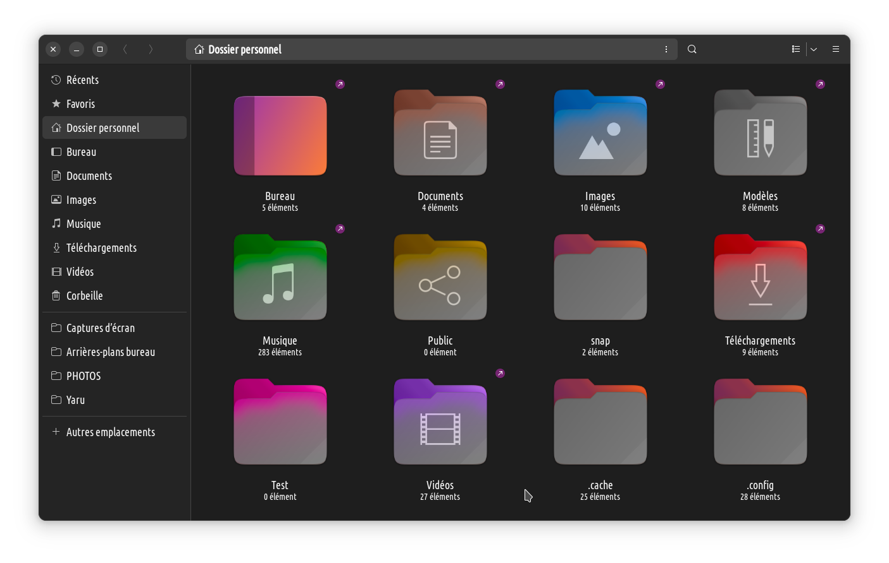

# Yaru-folders-recolored

It's a mix between Yaru « regular » folders as seen in 22.04 / 22.10, in their orange variant
and Yaru colored folder from https://github.com/costales/folder-color
because I like colors but I also like the grey foundation of original Yaru icons
which keeps the whole thing « harmonized ».

## some useful commands, just in case I'd forget them

From a folder, resizing all .png and send them into another folder :

`for i in $(ls *.png); do sudo convert -resize 32x32 $i /usr/share/icons/Yaru/32x32/places/$i; done`

From a folder, copy to ~/Desktop file with matching names :

`find . -name 'folder-*-publicshare.png' -exec cp {} ~/Bureau/ \;`

Nautilus ( is buggy as hell in Ubuntu 22.10 ) but offers easy batch renaming : select elments and hit F2.
